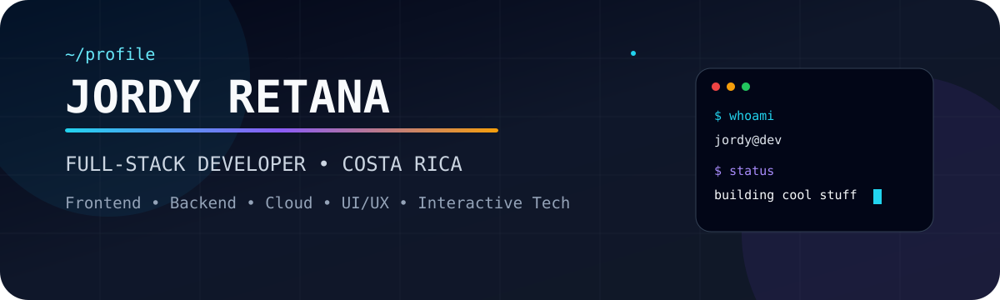

<!-- =========================================================
     JORDY RETANA — GITHUB PROFILE
     Custom animated developer profile
========================================================= -->

<p align="center">
  
</p>

<p align="center">
  <a href="https://github.com/JordyRetana">
    
  </a>
  <a href="https://www.linkedin.com/in/jordy-retana-553632164/">
    
  </a>
  <a href="mailto:jretanamendez@gmail.com">
    
  </a>
</p>

<p align="center">
  
</p>

---

## `> whoami`

```ts
const jordy = {
  location: "Costa Rica 🇨🇷",
  role: "Full-Stack Developer",
  mindset: ["build", "learn", "iterate", "polish"],
  interests: [
    "Frontend Engineering",
    "Backend Architecture",
    "Cloud & Automation",
    "UI / UX",
    "Interactive & 3D Experiences"
  ],
  currently: "Turning ideas into useful, polished software"
};
```

<p align="center">
  I like software that feels <b>fast</b>, <b>clean</b>, <b>useful</b> and <b>intentional</b>.
  <br />
  I enjoy working from the interface all the way down to the architecture behind it.
</p>

---

## `> system.capabilities`

<table>
  <tr>
    <td width="25%" align="center">
      <h3>⚡ Frontend</h3>
      <p>Responsive interfaces, reusable components, animations and polished UI.</p>
    </td>
    <td width="25%" align="center">
      <h3>🧠 Backend</h3>
      <p>APIs, business logic, authentication, databases and maintainable architecture.</p>
    </td>
    <td width="25%" align="center">
      <h3>☁️ Cloud</h3>
      <p>Containers, deployments, automation and practical cloud workflows.</p>
    </td>
    <td width="25%" align="center">
      <h3>🎮 Creative Tech</h3>
      <p>3D experiments, interactive prototypes and game-inspired experiences.</p>
    </td>
  </tr>
</table>

---

## `> tech.stack --visual`

<p align="center">
  
</p>

<p align="center">
  
  
  
  
</p>

---

## `> current.focus`

<p align="center">
  
</p>

<table>
  <tr>
    <td align="center" width="20%"><b>React</b><br/><sub>Interfaces</sub></td>
    <td align="center" width="20%"><b>NestJS</b><br/><sub>APIs</sub></td>
    <td align="center" width="20%"><b>.NET</b><br/><sub>Systems</sub></td>
    <td align="center" width="20%"><b>Docker</b><br/><sub>Workflow</sub></td>
    <td align="center" width="20%"><b>Unity / Unreal</b><br/><sub>Interactive Tech</sub></td>
  </tr>
</table>

---

## `> github.activity`

<p align="center">
  
</p>

<p align="center">
  
  
</p>

---

## `> contribution.snake`

<p align="center">
  <picture>
    <source media="(prefers-color-scheme: dark)" srcset="https://raw.githubusercontent.com/JordyRetana/JordyRetana/output/github-contribution-grid-snake-dark.svg" />
    <source media="(prefers-color-scheme: light)" srcset="https://raw.githubusercontent.com/JordyRetana/JordyRetana/output/github-contribution-grid-snake.svg" />
    
  </picture>
</p>

---

## `> build.philosophy`

```text
01. Understand the problem.
02. Build the simplest solid solution.
03. Make the interface feel intentional.
04. Refactor what deserves to survive.
05. Ship. Learn. Improve. Repeat.
```

<p align="center">
  
</p>

<p align="center">
  <a href="https://www.linkedin.com/in/jordy-retana-553632164/">
    
  </a>
  <a href="mailto:jretanamendez@gmail.com">
    
  </a>
</p>

<p align="center">
  <sub>Designed as code. Built to evolve.</sub>
</p>
