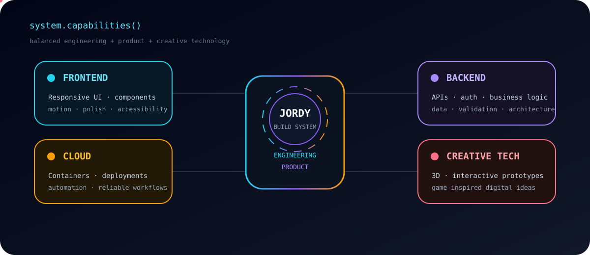
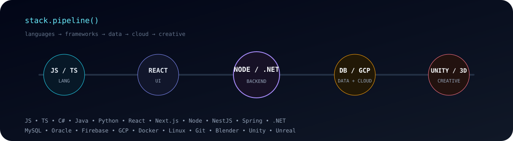
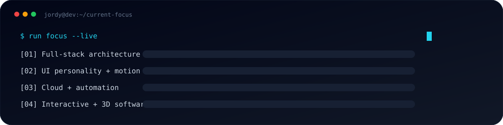

<!-- =========================================================
     JORDY RETANA — GITHUB PROFILE
     Custom animated developer identity
========================================================= -->

<p align="center">
  
</p>

<p align="center">
  <a href="https://github.com/JordyRetana">
    
  </a>
  <a href="https://www.linkedin.com/in/jordy-retana-553632164/">
    
  </a>
  <a href="mailto:jretanamendez@gmail.com">
    
  </a>
</p>

<p align="center">
  
</p>

---

## `> whoami`

```ts
const jordy = {
  location: "Costa Rica",
  role: "Full-Stack Developer",
  approach: "Build → Polish → Simplify → Ship",
  focus: [
    "Frontend Engineering",
    "Backend Architecture",
    "Cloud & Automation",
    "UI / UX",
    "Interactive & 3D Experiences"
  ]
};
```

I enjoy building software that feels **fast, intentional and polished** — not just software that technically works.

---

## `> system.capabilities`

<p align="center">
  
</p>

---

## `> tech.stack --motion`

<p align="center">
  
</p>

<p align="center">
  
</p>

---

## `> current.mode --live`

<p align="center">
  
</p>

> Build useful things. Make them feel good. Keep the code maintainable.

---

## `> contribution.signal`

<p align="center">
  <picture>
    <source media="(prefers-color-scheme: dark)" srcset="https://raw.githubusercontent.com/JordyRetana/JordyRetana/output/github-contribution-grid-snake-dark.svg" />
    <source media="(prefers-color-scheme: light)" srcset="https://raw.githubusercontent.com/JordyRetana/JordyRetana/output/github-contribution-grid-snake.svg" />
    
  </picture>
</p>

---

## `> engineering.philosophy`

```text
01  Understand the real problem.
02  Build the simplest solid solution.
03  Give the interface personality.
04  Refactor what deserves to survive.
05  Ship, learn, improve, repeat.
```

<p align="center">
  
</p>

<p align="center">
  <a href="https://www.linkedin.com/in/jordy-retana-553632164/">
    
  </a>
  <a href="mailto:jretanamendez@gmail.com">
    
  </a>
</p>

<p align="center"><sub>Designed as code. Built to evolve.</sub></p>
